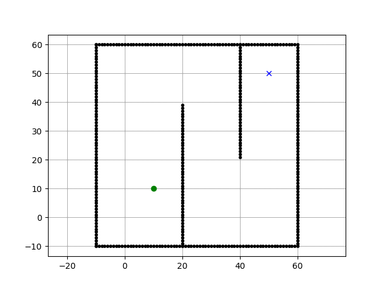
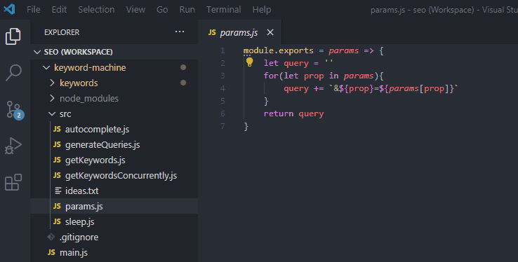

<!-- Improved compatibility of back to top link: See: https://github.com/othneildrew/Best-README-Template/pull/73 -->

<!--
*** Thanks for checking out the Best-README-Template. If you have a suggestion
*** that would make this better, please fork the repo and create a pull request
*** or simply open an issue with the tag "enhancement".
*** Don't forget to give the project a star!
*** Thanks again! Now go create something AMAZING! :D
-->

<!-- PROJECT SHIELDS -->
<!--
*** I'm using markdown "reference style" links for readability.
*** Reference links are enclosed in brackets [ ] instead of parentheses ( ).
*** See the bottom of this document for the declaration of the reference variables
*** for contributors-url, forks-url, etc. This is an optional, concise syntax you may use.
*** https://www.markdownguide.org/basic-syntax/#reference-style-links
-->

<!-- PROJECT LOGO -->
 

  

  

  <h2 align="center">AAE 2004 Group 7 Project</h3>

  

    =========
     
     
     
  

<!-- TABLE OF CONTENTS -->

  
Table of Contents

  <ol>
    <li>
      <a href="#background-of-path-planning-to-aviation-engineering">Background of Path Planning to Aviation Engineering</a>
    </li>
    <li>
      <a href="#theory-of-path-planning-algorithm">Theory of Path Planning Algorithm</a>
    </li>
    <li>
      <a href="#introduction-of-the-engineering-tools">Introduction of the Enginnering Tools</a>
      <ol type = "a">
        <li><a href="#python">Python</a></li>
        <li><a href="#github">Github</a></li>
      </ol>
    </li>
    <li>
      <a href="#task-1-methodology-results-and-discussion">Task 1: Methodology, Results and Discussion</a> 
       <ol type="a">
         <li><a href="#methodology">Methodology</a></li>
         <li><a href="#results">Results</a></li>
         <li><a href="#discussion">Discussion</a></li>
        </ol>
       </li>
     <li>
      <a href="#task-21-methodology-results-and-discussion">Task 2.1: Methodology, Results and Discussion</a> 
       <ol type="a">
         <li><a href="#methodology">Methodology</a></li>
         <li><a href="#results">Results</a></li>
         <li><a href="#discussion">Discussion</a></li>
        </ol>
       </li>
    <li>
     <a href="#task-22-methodology-results-and-discussion">Task 2.2: Methodology, Results and Discussion</a> 
       <ol type="a">
         <li><a href="#methodology">Methodology</a></li>
         <li><a href="#results">Results</a></li>
         <li><a href="#discussion">Discussion</a></li>
        </ol>
       </li>
    <li>
     <a href="#task-3-methodology-results-and-discussion">Task 3: Methodology, Results and Discussion</a> 
       <ol type="a">
         <li><a href="#methodology">Methodology</a></li>
         <li><a href="#results">Results</a></li>
         <li><a href="#discussion">Discussion</a></li>
        </ol>
       </li>
    <li>
      <a href="">Reflective Essay</a>
       <ol type = "a">
         <li><a href="#sahat-mahmud">Sahat Mahmud</a>
         <li><a href="#muhammad-inamul-haq">Muhammad Inamul Haq</a>
         <li><a href="#yajiao-liu">Yajiao Liu</a>
         <li><a href="#ma-fandhu">Ma Fandhu</a>
         <li><a href="#miao-kaili">Miao Kaili</a>
         <li><a href="#ziyang-liu">Ziyang Liu</a>
         <li><a href="#abcd">abcd</a>
       </ol>
      <li>
         <a href="#references">References<a>
       </li>
  </ol>

<!-- BACKGROUND OF PATH PLANNING TO AVIATION ENGINNERING -->
## Background of Path Planning to Aviation Engineering

Flying a piloted aircraft in a hazardous environment, such as battle zones or severe weather is a risky task. This puts the pilot’s life as well as the passengers’ lives at risk. This is where comes the idea of UAVs or Unmanned Aerial Vehicles, which can accomplish many missions at relatively low cost without putting human pilots in danger. But these UAVs need to avoid obstacles and pop-up threats as they fly through dynamic environments. Dealing with the unpredictability brought on by a changing environment and implementing autonomous decision-making within a set time window are two of the main difficulties in UAV path planning. To solve this problem, many researchers have come up with many path planning algorithms which allow the aircrafts move through dynamic paths. Some of these algorithms are - Voronoi Diagram, A* algorithm, D* algorithm, D* lite algorithm, Genetic algorithms etc. The goal of path planning is to create a real-time trajectory that avoids collisions and obstructions and leads to a target.  
  

    
  

  

    Fig 01: A* algorithm
  

  

    
  

  

    Fig 02: D* algorithm
  

  

    
  

Safety is the main concern in the aviation industry. Engineers, scientists and aviation enthusiasts are working hard to make the air safe for everyone to travel. To make sure aircrafts don't fall into any trouble, path planning algorithms are important. Path planning decides an optimal or nearly optimal trajectory in terms of some cost function that reflects an aircraft's effectiveness such as total fuel use or total flight time. This way, an aircraft gets a safe and cost efficient path to follow to its destination. 

(<a href="#readme-top">back to top</a>)

<!-- THEORY OF PATH PLANNING ALGORITHM -->
## Theory of Path Planning Algorithm

 For path planning, we used the A* algorithm, which combines the advantages and disadvantages of the depth-first search algorithm and the breadth-first search algorithm. It constructs a cost function based on a heuristic function that takes into account both the cost of the distance of the new node from the initial point and the cost of the distance of the new node from the target point. A* algorithm requires the maintenance of two state tables, non-separately called the openList and the closeList . OpenList consists of nodes to be examined, and CloseList consists of nodes that have already been examined.

The specific process： Firstly, we need to simplify the search area. Assuming that there is a barrier between the Start node and the Target node, and then, we rasterize the map and name the center of each square as a node, which reduces our search area to a 2-dimensional array. Each item of the array represents a grid, and its state is walkable and unwalkable. The path is found by working out which squares need to be walked through to get from the Start node to the Target node
 
Then we start searching to find the shortest path. In the beginning, we add the starting point to the openList. And from the starting point, check its neighboring squares and then expand in all directions until the goal is found. Afterward, we select the node with the lowest cost of movement among the nodes adjacent to the Start node and move it to the closeList based on the movement cost evaluation function f(n)=g(n)+h(n) (f(n) is the estimated cost of moving from the initial state to the target state via state n, g(n) is the actual cost of moving from the initial state to state n in the state space, and h(n) is the estimated cost of the best path from state n to the target state). 

For the 8 adjacent squares of the current square：
a: if it is unreachable or it is in the closeList, ignore it.
b: if it is not in the openList, add it to the openList and set the current square as its parent, recording the f, g , and h values for that square.
c: if it is already in the openList, check if this is a better path, using the g value as a reference; a smaller g value means this is a better path. If the g value is smaller, set the parent of that node to the current square and recalculate its g and h values.

Repeat the above process until the target node is searched, completing the path search and ending the algorithm

(<a href="#readme-top">back to top</a>)

<!-- INTRODUCTION OF THE ENGINEERING TOOLS -->
## Introduction of the Engineering Tools

For this project we have used two major tools for programming. One is Python, another one is GitHub.

### Python
Python is a popular computer programming language used to create software and websites, automate processes, and analyze data. Python is a general-purpose language, which means it may be used to make many various types of applications and isn't tailored for any particular issues. Its adaptability and beginner-friendliness have elevated it to the top of the list of programming languages in use today. 

  
  

Python is frequently used for creating websites and applications, automating repetitive tasks, and analyzing and displaying data. Python has been used by many non-programmers, including accountants and scientists, for a variety of routine activities including managing finances since it is very simple to learn. Due to its "Easy to Learn" nature, we have used this language for our project as most of us did not have any prior programming knowledge. For modifying the source code which was provided to us for completing our tasks, we used Visual Studio Code or VSCode. Visual Studio Code, also commonly referred to as VS Code, is a source-code editor made by Microsoft with the Electron Framework, for Windows, Linux and macOS. VSCode's user friendly UI helped us to work on our project without facing any technical problem. Features like debugging assistance, syntax highlighting, intelligent code completion, snippets, code refactoring, and embedded Git made us choose VSCode as our code editor.

  
  

  
### Github
At a high level, GitHub is a website and cloud-based service that helps developers store and manage their code, as well as track and control changes to their code. In simple words, GitHub is the social media for coders all over the world. It is a platform where people can collaborate on a programming based project and publish codes publicly so that others can use it as there need. As our project was a group based project, we needed to collaborate with each other. This is why we used github. Using GitHub we have been able to contribute on the Source Code, and publish the code time-to-time.   
  

  
  

To understand GitHub, we need to get familiar with two connected principles:
 

   <ul>
     <li>Version Control</li>
     Version control facilitates the management and tracking of coding changes in software projects. Version management is crucial when a software project expands. Version Control lets developers safely work through branching and merging. A developer replicates some of the source code using branching (called the repository). The developer can then safely modify that section of the code without affecting the project's overall success. The developer can then "Merge" that code back into the primary source code to make it official after getting their particular portion of the code to perform properly.
     <li>Git</li>
     Git is a specific open-source version control system created by Linus Torvalds in 2005. Git is a distributed version control system, which implies that every developer's computer has access to the whole codebase and history, making branching and merging simple. 
  </ul>
  

  

  Since anyone can join and host a public code repository there at no cost, open-source projects are particularly fond of GitHub.
  

(<a href="#readme-top">back to top</a>)

<!-- TASK 1: METHODOLOGY, RESULTS AND DISCUSSION -->
## Task 1: Find an appropriate aircraft model that achieve minimum cost for each scenario 

In task1, we aim to find an appropriate aircraft model that achieves the minimum cost for the three different scenarios in our obstacle set. It can be separated into two steps. In the first step, we need first to set up the obstacles, which include two cost intensive areas (20% and 40% additional flight time for cost intensive areas for Time and Fuel) and three walls. And then, we use A* path planning algorithm to calculate the time traveled to find the fast path and the minimum travel time. The pictures below are the results.

Then we use the Then we use the multi-conditional judgment of IF statement to compare the cost of three different aircraft types to find the minimum cost for each scenario while satisfying passenger needs.The pictures below show the codes in detail.

The picture below shows the results of scenario 1.

<!-- TASK 2: METHODOLOGY, RESULTS AND DISCUSSION -->
## Task 2: Design a new cost area that can reduce the cost of the route

In the progress of solving Task 2, we know that the area of the cost reduction area is fixed according to the given conditions. So if we want to minimize the final navigation cost, the goal we need to achieve is to make the shipping route through the selected area as long as possible. In choosing this cost reduction area, our initial idea is to first set up a block with constant horizontal coordinates and shifting vertical coordinates. Then the vertical coordinates of the region are made to move from the lowest to the highest point at a unit rate of one frame at a time, and the length of the route through the selected region in Task 1 is calculated. At the same time, these length data and the corresponding index of the longitudinal coordinates are stored in a list. When the cycle is completed, the largest data in the list and its corresponding vertical coordinates are found. At this point, we can get the location of the best region. However, since it was not possible to define the lengths of the regions through which the routes in Task 1 passed, we were not able to compare the lengths through which the routes passed in all the location regions according to the initial idea. In order not to interfere with the project, we had to fuzzify the selection of regions in order to find a value approximately close to the correct result.The specific code is shown in the figure below.
  
  
  
  
  
  
  

  And the result of the code is just like the plot:
  
  

<!-- TASK 3: METHODOLOGY, RESULTS AND DISCUSSION -->
## Task 3: Design a new aircraft model within the constrains to achieve minimum cost for your group challenge
For task3, we need to come up with a suitable aircraft based on the given conditions, such as the number of passengers, fuel bills, fixed costs, etc. At the very beginning, we think it is like a maths problem and our idea to solve this task is divided into two situations, one is when the passenger capacity of the aircraft is less than 300, and the other is when the passenger capacity of the aircraft is more than 300. We can write an equation in code based on given conditions to know the lowest cost and the most suitable aircraft capacity. But when we tried to do this, we found that the number of passengers we calculated was not an integer. After we thought about it for a while, we realized that when we were programming, we didn't define the unknowns enough, which led to inaccurate results. After modifying the code, the program ran correctly and came to a conclusion.
  

  
  

Like the picture1 and picture 2 showed, we defined all the condition  and list equation. Then we can find the minimum cost in the list through code. What's more, we add a code "PC%50==0" to make the final answer is a integer. And the third picture showed our final result. 

<!-- REFLECTIVE ESSAY -->
## Reflective Essay

### Sahat Mahmud

### Muhammad Inamul Haq

### Yajiao Liu
This project has meant a lot to me because this could be considered the turning point from my introduction to programming to writing programs. In our group, I was mainly responsible for coding three tasks and gained much from them. It was the first time I realized the importance of rigorous thinking and adjusting logical thinking. For instance, in step 2 of task 1, I started to forget the limit on the number of flights to add. After solving this, I tried to use a while True loop but found that the path was not output. Finally, I selected a multi-conditional judgment using IF. Throughout the writing process, write down specific ideas, translate them into the programming language, solve one problem after another that is encountered, complete the task requirements, and then recheck the code， which makes me feel the charm of code. However, although my code can meet the basic needs of the task, its quality still needs to be improved. The issue of code quality improvement is also something I want to focus on in the future. In a word, I really enjoy the process of discussing and solving problems with my group members. Meanwhile, I am also grateful to this project for breaking my fear of programming and making me more confident to express my views to everyone.
### Miao Kaili

### Ziyang Liu
  The group project was successfully completed with the efforts of our team members. In working on this project, I was mainly responsible for the code research and reporting for Task 2. During the initial solution of Task 2, I was inspired by the principle of copying machine and wanted to make a defined line to scan from bottom to top for different positions of calculation. However, due to my limited ability to write code, I asked the rest of the group for help. The other members were quick to discuss this with me and put a lot of effort into solving the puzzle. However, the progress of the project was slowed down by the time spent on the code for Task 2. For the sake of the project and the rest of the group, I chose a less rigorous but achievable approach with the agreement of the other members. Although I did not perform as well as expected in this group task, I still acquired a lot of thinking and knowledge about writing code. At the same time, I felt the amazing efficiency and better solutions that come from working together with the group members, and I grew to enjoy the feeling of getting immediate feedback on the ideas I proposed. All in all, this AAE group project has benefited me a lot both in terms of professional knowledge and cooperative interaction.

### Ma Fanshu

### abcd

<!-- References -->
<Introduction to the A* Algorithm>
https://www.redblobgames.com/pathfinding/a-star/introduction.html

============
============

